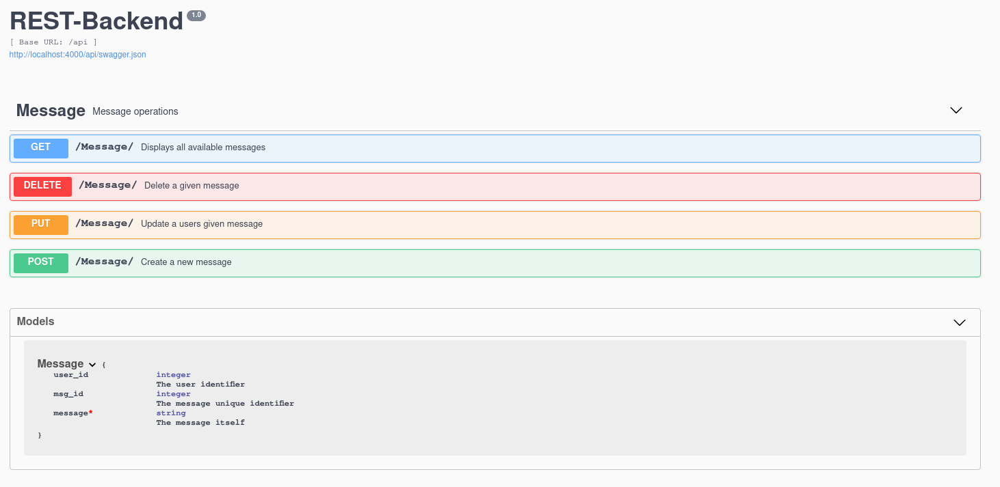

# REST-backend for simple CRUD operations.

REST-backend is a RESTful API that serves as a backend for a public message board.

It supports the simple <strong>CRUD</strong> operations <strong>(C)</strong>reate, <strong>(R)</strong>ead, <strong>(U)</strong>pdate, <strong>(U)</strong>elete:
```
A user can create a message in the service
A user can modify their own messages
A user can delete their own messages
A user can view all messages in the service
```
**Assumption:** Validation of username/ID is assumed to have been validated by another REST endpoint.

The API uses Python and MongoDB, it uses the following dependencies:
* [Flask](http://flask.pocoo.org/)
* [Flask-RestPlus](https://flask-restplus.readthedocs.io/en/stable/)
* [Flask-PyMongo](https://flask-pymongo.readthedocs.io/en/latest/)

Thanks to Flask-RestPlus we get a nice [Swagger UI](https://swagger.io/tools/swagger-ui/) for easy visualisation on the
API as well as documentation and being able to test out the API.



## Getting Started


### Prerequisites

You will need both Docker and Docker-compose:

#### Docker installation guide:

 **Arch Linux:**
 ```
 sudo pacman -S docker
 ```
**Ubuntu:** [Docker offical ubuntu guide](https://docs.docker.com/install/linux/docker-ce/ubuntu/)

#### Docker-compose installation guide:
 **Arch Linux & Ubuntu:**
 ```
 sudo curl -L "https://github.com/docker/compose/releases/download/1.24.0/docker-compose-$(uname -s)-$(uname -m)" -o /usr/local/bin/docker-compose
 sudo chmod +x /usr/local/bin/docker-compose
 ```

### Running REST-Backend
Clone the repo:
```
git clone https://github.com/Brew8it/REST-backend.git && cd REST-backend
```
Build and start our docker image and start our mongodb service
```
docker-compose up --build
```
You will now be able to navigate to the following url and start using swagger UI test the API from there
```
http://localhost:4000/
```
#### Or if you want to use curl:
A user can create a message in the service
```
curl -X POST "http://localhost:4000/api/Message/" -H "accept: application/json" -H "Content-Type: application/json" -d "{ \"user_id\": 0, \"msg_id\": 0, \"message\": \"string\"}"
```
A user can modify their own messages
```
curl -X PUT "http://localhost:4000/api/Message/" -H "accept: application/json" -H "Content-Type: application/json" -d "{ \"user_id\": 0, \"msg_id\": 0, \"message\": \"string\"}"
```
A user can delete their own messages
```
curl -X DELETE "http://localhost:4000/api/Message/" -H "accept: application/json" -H "Content-Type: application/json" -d "{ \"user_id\": 0, \"msg_id\": 0, \"message\": \"string\"}"
```
A user can view all messages in the service
```
curl -X GET "http://localhost:4000/api/Message/" -H "accept: application/json"
```

